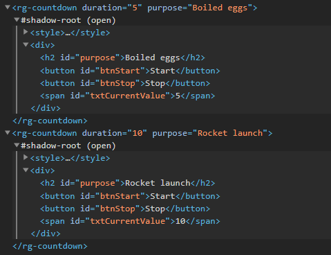

# Web components

*December 2020*

> 🔨 From udemy '[Les Web Components par la pratique](https://www.udemy.com/course/les-web-components-par-la-pratique/)'.

Web Components are a set of web platform APIs that allow you to create new custom, reusable, encapsulated HTML tags to use in web pages and web apps. If you are familiar with building components in libraries like React or Angular, Web Components should feel similar. Thanks to them, developers are no longer limited to the existing HTML tags that the browser vendors provide.


## Concepts: three main technologies

- **Custom elements**: A set of JavaScript APIs that allow you to define custom elements and their behavior, which can then be used as desired in your user interface.
- **Shadow DOM**: A set of JavaScript APIs for attaching an encapsulated "shadow" DOM tree to an element — which is rendered separately from the main document DOM — and controlling associated functionality. In this way, you can keep an element's features private, so they can be scripted and styled without the fear of collision with other parts of the document.
- **HTML templates**: The <template> and <slot> elements enable you to write markup templates that are not displayed in the rendered page. These can then be reused multiple times as the basis of a custom element's structure.

- **Deprecated - HTML Imports**: Was: `<link rel="import" href="myfile.html">`. This feature is **obsolete**. Although it may still work in some browsers, its use is discouraged since it could be removed at any time. Try to avoid using it.

## Callbacks

*connectedCallback*: Invoked each time the custom element is appended into a document-connected element. This will happen each time the node is moved, and may happen before the element's contents have been fully parsed.

*attributeChangedCallback*: Invoked each time one of the custom element's attributes is added, removed, or changed. Which attributes to notice change for is specified in a static get observedAttributes method

## Shadow DOM

The ShadowRoot interface of the Shadow DOM API is the root node of a DOM subtree that is rendered separately from a document's main DOM tree. With Shadow DOM, each component instance is encapsulated in its own DOM.

The Element.attachShadow() method attaches a shadow DOM tree to the specified element and returns a reference to its ShadowRoot.



## Properties vs Attributes

Properties are available on a DOM node when being manipulated by JavaScript.

````js
const myElem = document.querySelector('.my-elem');

myElem.className; // className is a property
````

And attributes are provided in the HTML itself. Here *alt*, *width* and *height* are all attributes.

````js

````

## Useful links
- [codeconcept/webcompomisc](https://github.com/codeconcept/webcompomisc)
- [codeconcept/webcompomap](https://github.com/codeconcept/webcompomap)
- [MDN: Web Components](https://developer.mozilla.org/en-US/docs/Web/Web_Components)
- [MDN: Using custom elements](https://developer.mozilla.org/en-US/docs/Web/Web_Components/Using_custom_elements)
- [Attributes and Properties in Custom Elements](https://alligator.io/web-components/attributes-properties/)