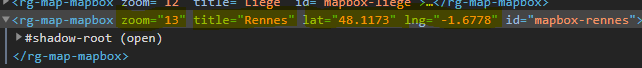

# Web components

*January 2021*

> 🔨 Web components overview using maps. From udemy '[Les Web Components par la pratique](https://www.udemy.com/course/les-web-components-par-la-pratique/)'. The content of the training has been improved using Open Street Maps and leaflet.js.

Web Components are a set of web platform APIs that allow you to create new custom, reusable, encapsulated HTML tags to use in web pages and web apps. If you are familiar with building components in libraries like React or Angular, Web Components should feel similar. Thanks to them, developers are no longer limited to the existing HTML tags that the browser vendors provide.

Demo on [Netlify](https://adoring-hodgkin-826062.netlify.app/)


## How to use

### Change datas using HTML source code or DevTool elements

Components can be added using HTML and 4 attributes can be changed:

- zoom
- title
- lat
- lng

````html
<rg-map-mapbox zoom=13 title="Rennes" lat=48.1173 lng=-1.6778 id="mapbox-rennes"></rg-map-mapbox>
````

The id is mandatory to change datas programmatically in DevTool console.


attribute-devtool.png

### Change data using DevTool console

Note: In the code below, the id refers to the one used in HTML content.

Exemple:
````html
<rg-map-mapbox zoom=12 title="Liège" id="mapbox-liege"></rg-map-mapbox>
````

**Add a marker**

````js
mapDiv = document.getElementById('mapbox-liege);
mapDiv.markersPositions  = {position: {lat: 50.61135, lng: 5.59943}, content: "Angleur", draggable: false}
mapDiv.markersPositions  = {position: {lat: 50.63412, lng: 5.47566}, content: "Grâce-Hollogne", draggable: true}
````

When you click on the marker, the content propertie will be displayed as pop-up.

If a marker is not draggable (false), it will be displayed in red otherwise in blue.

The content displayed in popup will be its new coordinates.

**Replace map with new location**

````js
mapDiv = document.getElementById('mapbox-liege');
mapDiv.geoData = {center:{lat:48.4, lng:-4.4833}, zoom: 12, title: 'Brest'}
````

**Display most recent marker inserted**

````js
mapDiv = document.getElementById('mapbox-liege');
mapDiv.mostRecentMarker
````

**Clickable map to add markers when clicking on it**

````js
mapDiv = document.getElementById('mapbox-liege');
mapDiv.mapListensForClick = true
````

## Concepts: three main technologies

- **Custom elements**: A set of JavaScript APIs that allow you to define custom elements and their behavior, which can then be used as desired in your user interface.
- **Shadow DOM**: A set of JavaScript APIs for attaching an encapsulated "shadow" DOM tree to an element — which is rendered separately from the main document DOM — and controlling associated functionality. In this way, you can keep an element's features private, so they can be scripted and styled without the fear of collision with other parts of the document.
- **HTML templates**: The <template> and <slot> elements enable you to write markup templates that are not displayed in the rendered page. These can then be reused multiple times as the basis of a custom element's structure.

- **Deprecated - HTML Imports**: Was: `<link rel="import" href="myfile.html">`. This feature is **obsolete**. Although it may still work in some browsers, its use is discouraged since it could be removed at any time. Try to avoid using it.

## Callbacks

*connectedCallback*: Invoked each time the custom element is appended into a document-connected element. This will happen each time the node is moved, and may happen before the element's contents have been fully parsed.

*attributeChangedCallback*: Invoked each time one of the custom element's attributes is added, removed, or changed. Which attributes to notice change for is specified in a static get observedAttributes method

## Shadow DOM

The ShadowRoot interface of the Shadow DOM API is the root node of a DOM subtree that is rendered separately from a document's main DOM tree. With Shadow DOM, each component instance is encapsulated in its own DOM.

The Element.attachShadow() method attaches a shadow DOM tree to the specified element and returns a reference to its ShadowRoot.


## Properties vs Attributes

Properties are available on a DOM node when being manipulated by JavaScript.

````js
const myElem = document.querySelector('.my-elem');

myElem.className; // className is a property
````

And attributes are provided in the HTML itself. Here *alt*, *width* and *height* are all attributes.

````js

````

## Useful links
- [codeconcept/webcompomisc](https://github.com/codeconcept/webcompomisc)
- [codeconcept/webcompomap](https://github.com/codeconcept/webcompomap)
- [MDN: Web Components](https://developer.mozilla.org/en-US/docs/Web/Web_Components)
- [MDN: Using custom elements](https://developer.mozilla.org/en-US/docs/Web/Web_Components/Using_custom_elements)
- [Attributes and Properties in Custom Elements](https://alligator.io/web-components/attributes-properties/)
- [ApiNotActivatedMapError for simple html page using google-places-api](https://stackoverflow.com/questions/35700182/apinotactivatedmaperror-for-simple-html-page-using-google-places-api)
- [Leaflet Tutorials](https://leafletjs.com/examples.html)
- [Webcomponent with internal js and css doesn't show content](https://stackoverflow.com/questions/58272007/webcomponent-with-internal-js-and-css-doesnt-show-content)
- [MapBox](https://www.mapbox.com/)
- [OpenStreetMap Belgique](https://openstreetmap.be/fr/)
- [OpenStreetMap France](https://www.openstreetmap.fr/)